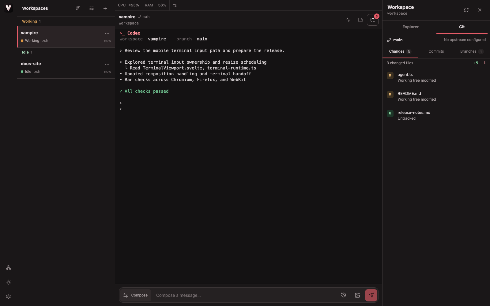
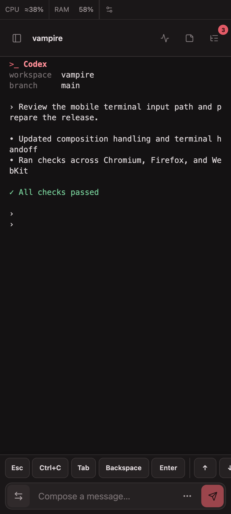

# Vampire

**Keep your coding agents running in tmux. Continue the same conversation from a desktop or mobile browser.**

<table>
  <tr>
    <td width="78%" valign="top">
      
    </td>
    <td width="22%" valign="top">
      
    </td>
  </tr>
</table>

Vampire is a small, self-hosted browser UI for Codex, Claude Code, and ordinary shell sessions. The CLI, credentials, and project files stay on your machine.

## Quick start

### 1. Install prerequisites

You need Node.js 22.18+ and tmux.

macOS (Homebrew):

```bash
brew install tmux
```

Debian, Ubuntu, or WSL2:

```bash
sudo apt update
sudo apt install tmux
```

Fedora:

```bash
sudo dnf install tmux
```

Arch:

```bash
sudo pacman -S tmux
```

### 2. Start Vampire

```bash
npx vampire
```

Open the printed URL, choose a project directory, and create a workspace.

### 3. Start your CLI

Inside a workspace, run the agent or shell you already use:

```bash
codex
# or
claude
```

The process keeps running in tmux when you close the browser. Reopen the workspace from any device to continue.

Open a workspace's actions menu and choose **Startup profile** to add a startup command there or reuse one previously created in another workspace. Profile definitions are shared by the whole Vampire server and synchronized to every connected device, while each workspace independently chooses which one to run whenever Vampire creates or reopens its shell. Saving does not run anything in the current session, and profiles do not create additional terminals.

On tmux 3.7a or newer, Vampire answers terminal color probes with the active browser theme. Older tmux versions remain supported but cannot relay these probes. Start a TUI after the terminal is connected so it can detect the correct palette. Some TUIs, including Codex, cache that palette for the lifetime of the process; after switching between light and dark, exit and resume the TUI once to refresh application-drawn RGB backgrounds.

Use the **Background** bar below the terminal to run a development server or watcher without touching the main session. Background commands keep running when the browser disconnects, expose read-only output, and can be stopped directly from the bar. Completed commands can be run again or deleted, and commands you explicitly star are saved per workspace for later use. Vampire never adds commands to favorites automatically, so a command containing a token or password is not persisted in the workspace registry unless you choose to star it.

For parallel work in a Git repository, open the workspace actions menu and choose **New isolated workspace**. Vampire creates a new branch and Git worktree from the source workspace's current commit, then opens a separate tmux session there. Uncommitted source changes are not copied; the source workspace's startup profile selection and favorite background commands are inherited. An inherited startup profile runs as soon as the new workspace opens.

Managed worktrees live at `$VAMPIRE_STATE_DIR/worktrees/<workspace-id>/<project-name>` (under `~/.vampire` by default). Removing one from Vampire stops its shell, deletes the managed working copy (including uncommitted files), and clears its Git worktree registration while preserving its branch. If another tool or coding agent removes the directory first, Vampire keeps any live terminal available and marks the working copy as missing; explicitly removing that workspace later clears the stale Git registration.

Use **Set workspace alias** from any workspace actions menu to give a regular directory or worktree a separate display name. A new isolated workspace starts with its task name as the alias. Aliases do not rename directories or branches, and they are stored on the Vampire server so every connected device sees the same name.

The **Smart** or **Manual** workspace ordering mode and the manual row order are also stored on the server and synchronized between devices. Existing browser-local ordering preferences are imported the first time a server without shared ordering preferences is opened.

### Customize the status bar

The server-wide status bar runs editable command plugins and shares each result with every connected browser. CPU, RAM, Codex Limit, and Claude Limit are starting points rather than special UI types.

See [Status plugins](docs/status-plugins.md) for the SwiftBar-style text format and generic JSON menu model.

## What you get

- Persistent tmux sessions for Codex, Claude Code, and any CLI.
- Git worktree-based isolated workspaces for parallel tasks in one repository.
- Supervised background commands with live output, reruns, deletion, and explicit favorites.
- A SwiftBar-style server status strip with ordered presets and user-defined command plugins.
- The same workspace from a desktop or mobile browser.
- Server-synchronized workspace aliases and manual ordering.
- Smart status groups for main sessions that are working, need review, are idle, or have ended.
- Notes and process labels in the workspace list.
- On-demand host TCP port inspection with guarded process termination.
- Git diffs, image previews, text editing, and inline file/folder creation.
- Light and dark themes with a mobile-friendly terminal.

| State | Meaning |
| --- | --- |
| Working | The main terminal is producing output. |
| Review needed | New main-terminal output is waiting for you to check it. |
| Idle | The main terminal has no unreviewed output. |
| Ended | The saved workspace no longer has a running tmux shell. |

## Remote access

Vampire is local-only by default. If you need to access it from another device, set a token and put it behind HTTPS or a private network:

```bash
VAMPIRE_TOKEN="$(openssl rand -base64 32)" npx vampire
```

Do not expose an unauthenticated instance to the public internet. See [SECURITY.md](SECURITY.md) for the threat model and reverse-proxy guidance.

For a trusted private network only, unauthenticated LAN access requires an explicit opt-in:

```bash
VAMPIRE_HOST=192.168.1.10 VAMPIRE_ALLOW_INSECURE_NO_AUTH=1 npx vampire
```

## Optional configuration

Running `npx vampire` needs no environment variables. Set only the options your deployment actually needs:

| Variable | Purpose | Default |
| --- | --- | --- |
| `VAMPIRE_HOST` | Bind address | `127.0.0.1` |
| `VAMPIRE_PORT` | HTTP port | `7677` |
| `VAMPIRE_TOKEN` | Bearer token for remote access | unset |
| `VAMPIRE_ALLOW_INSECURE_NO_AUTH` | Allow a non-loopback bind without authentication when set to `1` | unset |
| `VAMPIRE_WORKSPACE_ROOTS` | Server-side directories available to the workspace picker, separated by `:` (`;` on Windows) | server launch directory (`process.cwd()`) |
| `VAMPIRE_STATE_DIR` | Session registry, profiles, aliases, shared ordering, workspace notes, explicit command favorites, managed worktrees, and status plugin commands | `~/.vampire` |

Project files, commands, terminal history, and running processes stay on your machine. The workspace picker and new sessions are restricted to the configured workspace roots; browsing reads only immediate child directories. Existing registered workspaces remain restartable even if they are outside a newly configured root.

### Workspace directory access

`VAMPIRE_WORKSPACE_ROOTS` controls which server-side directories can be selected when creating a workspace. Paths may be absolute, relative to the server launch directory, or use `~` for the server user's home directory.

```bash
# macOS or Linux: allow two project areas
VAMPIRE_WORKSPACE_ROOTS="$HOME/Code:$HOME/Projects" npx vampire
```

If it is unset or empty, the server launch directory is the only root. The root itself or any directory below it can be registered; Vampire stores that server path and starts the tmux session there. The manual path field uses the same validation, and paths outside the roots or non-directories are rejected.

## Development

```bash
pnpm install
pnpm dev
pnpm check
pnpm test
```

See [CONTRIBUTING.md](CONTRIBUTING.md) for the contributor workflow.

## License

MIT
