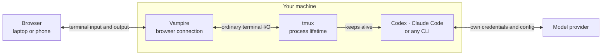

# Vampire

**Run coding agents in their original CLI, keep them alive in tmux, and check in from any browser.**


Vampire is a small, self-hosted workspace for Codex, Claude Code, and ordinary project shells. Your tools keep their own configuration and authentication, tmux keeps them running, and Vampire gives you a browser UI for checking and controlling them from a laptop or phone.

No agent SDK, hosted relay, transcript replay, or token-consuming summary layer sits in between.

## Quick start

You need Node.js 22 or newer and tmux on macOS, Linux, or WSL2.

```sh
npx vampire
```

Open `http://127.0.0.1:7677`, add an absolute project directory, then start the CLI you already use:

```sh
codex
# or
claude
```

Without `VAMPIRE_TOKEN`, Vampire stays local-only and shows no login screen. For remote access, set a token and place Vampire behind HTTPS, a VPN, or a private tunnel:

```sh
VAMPIRE_TOKEN="$(openssl rand -base64 32)" vampire
```

## What you get

- **Persistent workspaces.** Every workspace is a real tmux session that survives browser and Vampire restarts.
- **Several projects at a glance.** See the foreground process, recent activity, notes, and manually ordered workspaces in one navigator.
- **Changes without context switching.** The terminal header shows the changed-file count; the read-only repository drawer opens staged, working-tree, and untracked diffs alongside text and image previews.
- **Desktop and mobile control.** Use normal keyboard input on desktop, or the mobile composer with Escape, Ctrl-C, Tab, Enter, arrow keys, image input, and font controls.
- **Touch that still feels like a terminal.** A short tap interacts with the terminal while an intentional drag scrolls without becoming an accidental click or dismissing the mobile keyboard.
- **Dark and light themes.** Follow the system theme automatically or switch at any time.
- **No hidden agent work.** Vampire relays terminal input and output but does not rewrite prompts, call model providers, or spend agent tokens.

The workspace list uses three deliberately literal states:

| 🟡 Live | 🔵 Review | 🟢 Idle |
| --- | --- | --- |
| Terminal output is active | New output has not been viewed | Checked and quiet |

Activity states describe terminal output, not the agent's intent. Vampire does not guess whether an agent is finished or waiting for input.

## How it works



If a command works in your shell, it works in a Vampire session. tmux owns the process lifetime, the CLI owns its model requests and configuration, and Vampire owns the browser connection and its small session registry.

## Mobile

Open the same Vampire URL on a phone to review workspaces, scroll through output, and send the next instruction without reaching for a laptop.

<p align="center">
  
</p>

## Remote access and security

Vampire is a remote shell interface. Anyone who can authenticate can act with the operating-system permissions of the Vampire process. It is intended for one trusted person or a small trusted environment, not as a multi-tenant isolation boundary.

Keep Vampire bound to `127.0.0.1` and expose it through a same-host HTTPS reverse proxy or private network. It refuses non-loopback binding unless `VAMPIRE_TOKEN` is configured.

```sh
VAMPIRE_TOKEN="your-long-random-token" \
VAMPIRE_ADAPTER_ORIGIN="https://vampire.example.com" \
vampire
```

Minimal Caddy configuration:

```caddyfile
vampire.example.com {
	reverse_proxy 127.0.0.1:7677
}
```

The proxy must preserve the external `Host` header and support WebSocket upgrades. Read [SECURITY.md](SECURITY.md) before exposing Vampire outside your machine.

## Configuration

| Variable | Default | Purpose |
| --- | --- | --- |
| `VAMPIRE_HOST` | `127.0.0.1` | Node server address |
| `VAMPIRE_PORT` | `7677` | Node server port |
| `VAMPIRE_TOKEN` | unset | Enables token login and non-loopback binding |
| `VAMPIRE_STATE_DIR` | `~/.vampire` | Stores the session registry and workspace notes |
| `VAMPIRE_ADAPTER_ORIGIN` | unset | Public HTTPS origin used behind a reverse proxy |

Project files, commands, terminal history, and running processes stay on your machine. Repository reads are restricted to the workspace directory, and the viewer rejects path traversal, escaping symlinks, oversized files, and unsupported binary previews.

## Run from source

```sh
corepack enable
pnpm install --frozen-lockfile
pnpm dev
```

For a production build:

```sh
pnpm build
VAMPIRE_TOKEN="$(openssl rand -base64 32)" pnpm start
```

## Development

```sh
pnpm check    # Svelte and TypeScript diagnostics
pnpm test     # diagnostics, Node tests, and production build
```

See [CONTRIBUTING.md](CONTRIBUTING.md) before submitting a change.

Vampire is an early, pre-1.0 release for trusted personal use and small private environments. Configuration, storage, and APIs may change before 1.0.

## License

[MIT](LICENSE)
